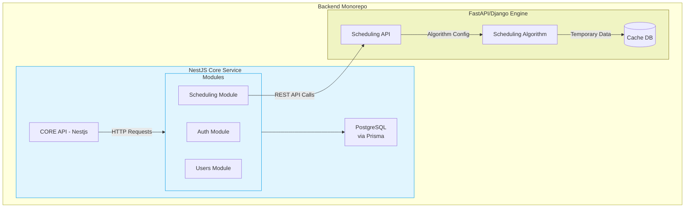

# Backend Structure
## System Structure
Our backend follows a monorepo structure with clear service boundaries, designed for scalability and maintainability. The architecture separates core application logic from specialized scheduling operations while promoting code reuse through shared resources.

Separating the core logic into a nestjs api, and delegating the actual scheduling to a python based framework like FASTAPI/Django.

***diagram made with mermaid.js. extension to view it in vscode: https://marketplace.cursorapi.com/items?itemName=bierner.markdown-mermaid***

## Core(Nestjs) Structure
### Overview
The Core API serves as the backbone of the backend application, built using NestJS. It is responsible for handling all web operations and business logic related to user management, authentication, and scheduling functionalities. The API is structured into distinct modules, each focusing on a specific domain, which is ig the way nest is usually structured. Here's some example modules:

1. **Auth Module**: Manages user authentication processes, including registration and login, while implementing role-based access control (RBAC) for secure access to resources.

2. **Users Module**: Handles user data management, allowing for the retrieval, updating, and deletion of user profiles.

3. **Scheduling Module**: Integrates with the scheduling engine, facilitating communication and data exchange for generating and managing schedules.

Each module will contain it's own dtos and unit tests for teh controller and the services.

### Directory Structure Breakdown

## Directory Structure
        backend/
        ├── core/                   # Main NestJS Application 
        │   ├── src/
        │   │   ├── modules/        # Split by domain features
        │   │   │   ├── auth/       # Authentication module
        │   │   │   ├── scheduling/ # Scheduling integration module
        │   │   │   ├── users/      # User management module
        │   │   │   └── ...         # Other modules
        │   │   ├── shared/         # Reusable components
        │   │   │   ├── decorators/ # Custom decorators
        │   │   │   ├── filters/    # Exception filters
        │   │   │   ├── interceptors/ # Request interceptors
        │   │   │   └── ...         # Other shared utilities
        │   │   ├── main.ts         # Existing entry file
        |   |   └── ...
        ├── scheduling-engine/      # Second API Application (FastAPI/Django)
        │   ├── app/
        │   │   ├── core/           # Scheduling algorithm implementation
        │   │   ├── routers/        # API endpoints
        │   │   └── ...             # Service-specific structure
        ├── docker/                 # Docker configurations
        │   ├── core.Dockerfile
        │   ├── scheduling.Dockerfile
        │   └── ...
        ├── scripts/                # Deployment/maintenance scripts
        ├── docs/                   # Technical documentation
        ├── docker-compose.yml      # Local development setup
        ├── package.json            # Workspace config (if using npm workspaces)
        └── .env.example            # Environment template

#### Core Service (`core/`)
The primary NestJS application handling web operations and business logic

#### Scheduling Engine (`scheduling-api/`)
Independent service for timetable generation (FastAPI/Django):

#### Shared Directory Structure
The `shared/` directory contains reusable components that cut across multiple modules:

1. **Decorators** (e.g., `@Public()` to bypass authentication)
2. **Filters** (Global exception handlers)
3. **Interceptors** (Request/response transformers, sentry/posthog interceptor for logging)
4. **Pipes** (Validation and data transformation)
5. **Guards** (Extended authentication checks)
6. **Utilities** (Common helpers like date formatting or sth)

# **Final Project Design Doc \- Backend**

## **Overview \- High Level Description of the project**

The System is an AI/ML-powered platform designed to optimize school timetables by balancing hard constraints (e.g., no course conflicts, room capacities) with soft constraints (e.g., teacher preferences, accessibility). The system is intended for educational institutions, universities for the moment, to modernize their scheduling processes. Unlike traditional rule-based systems, this system leverages advanced optimization techniques to provide scalable, flexible, and user-friendly solutions for educational institutions. Its primary goal is to minimize manual intervention, improve satisfaction among stakeholders, and enable efficient resource utilization.

## **Requirements**

## Core Functionalities

### 1. **Schedule Generation**

* Automatically generate schedules that satisfy hard and soft constraints.   
* Hard Constraints:

  * Room Schedule Overlap (taking the room type like labs into account)  
  * Teacher Schedule Overlap  
  * Student Group overlap  
  * Timeslot Validity (no classes during lunch, or after 10:00 for eg)  

* Soft Constraints:
  * Time preference for teachers  
  * Schedule classes in a week with the maximum/minimum possible gap in days.(? Not sure which one to go for, as it depends on teacher preferences too)  
  * Scheduling the harder courses earlier in the day. (can be determined from the course ECTS)
  * Floor considerations based on disability (should be in hard constraints, but i want to make it easier for the scheduler for now).  
  * (any others?)

### 2. **Conflict Detection and Resolution**

* Detecting scheduling conflicts? If we add manual overrides for admins, maybe showing when there are conflicts would be a good idea.

### 3. **Teacher Input for preferences**

* Have teachers specify working hours, room or location preferences, etc…  
* Generate user-friendly views of the schedule (e.g., grid or calendar format).  
* Allow filtering by teacher, room, or class.

### 4. **Schedule Visualization**

  Visualise the schedules for the users. Teachers should be able to view their own personal schedules, and students the schedules for their class groups. This should be the default screen for signed in users as well. We should also provide the schedules for the entire school, showing which rooms are being occupied by which class across the entire university. (and allow for filtering on top of it, but that can come later).  

### 5. **Data Input**

* The way the school admins input the data into the system is important. Information such as courses and rooms don’t change year to year, so we should avoid making them type out all the fields for all the courses/rooms and use a structured input format like a csv file and parse the required information from it. I’m not too sure how to handle that yet though.  
* For other constraints such as teacher preferences, we could have the teacher input it themselves directly on their page. Again, not too sure of this. Need to explore other options and the pros and cons of them before deciding.

### 6. **Export and Reporting**

Not sure about the reporting yet, but the schedules should be exportable for each section.

* Export schedules in formats like PDF or Excel for sharing.Format needs to be well defined and viewable within the web ui. It should also be downloadable, so we might need a way to do that too.  
* Provide analytics? Not sure about this one.What sort of analytics could be required. Posthog is an option, but what could we show? Need to explore this as well.

## **User Descriptions and Use cases**

### **School Administrators**

* **Role**: Oversee scheduling, input data, resolve conflicts, and manage the system.  
* **Use Cases**:  
  1. Log in securely to the admin dashboard.  
  2. Input data:  
     * Add teachers, rooms, and classes.  
     * Define hard constraints (e.g., courses, departments, sections, teacher availability for courses, room capacities).  
  3. Run the scheduling engine to generate a draft timetable.  
  4. Review the generated schedule:  
     * See conflicts flagged by the system (whatever the system generates should be good. Manual adjustments might cause conflicts though).  
     * Use system-suggested fixes(maybe have it regenerate the entire thing?) or manually adjust schedules.  
  5. Finalize and export the schedule.  
  6. View metrics if we do analytics.

  ### **3.2. Teachers**

* **Role**: Provide input on preferences and view their schedules.  
* **Use Cases**:  
  1. Log in securely to the teacher portal.  
  2. Specify preferences:  
     * Working hours/days, or other teacher specific (soft) constraints.  
     * Room preferences or special accommodations.  
  3. View personalized schedules.  
  4. Submit feedback? or flag conflicts for administrator review. (Not sure about this)

  ### **3.3. Students**

* **Role**: View finalized schedules.  
* **Use Cases**:  
  1. Log in (if permitted).  
  2. Access class schedules filtered by class group or subject.  
  3. Provide optional feedback on accessibility or conflicts.

## **Requirements**

– what i could come up with so far using the above description. Just a rough outline to get it started.

### **5.1. Functional Requirements**

1. **Data Input and Management**:  
   * Allow administrators to input teacher, room, and class data.  
   * Validate inputs to prevent missing or conflicting data.  
2. **Schedule Generation**:  
   * Generate schedules that meet all hard constraints.  
   * Optimize schedules for soft constraints.  
3. **Conflict Detection and Resolution**:  
   * Automatically identify scheduling conflicts.  
   * Provide actionable suggestions for resolution.  
4. **User Input and Preferences**:  
   * Allow teachers to specify working hours and preferences.  
   * Provide interfaces for feedback and manual adjustments.  
5. **Schedule Visualization**:  
   * Display schedules in grid or calendar formats.  
   * Enable filtering by teacher, room, or class.  
6. **Export**:  
   * Support exporting schedules in PDF and Excel formats.

   ### **5.2. Non-Functional Requirements**

1. **Performance**:  
   * Generate schedules for small-to-medium institutions within 2 minutes.  
2. **Scalability**:  
   * Handle increasing constraints and datasets efficiently.  
3. **Usability**:  
   * Ensure interfaces are intuitive and accessible for non-technical users.  
4. **Reliability**:  
   * Ensure data integrity and robust conflict detection.  
5. **Security**:  
   * Use role-based access control to secure sensitive data.

# Implementation Design

This section details the data formats, data models, and the core algorithmic approach for the scheduling system.

#### **1\. Data Input Strategy**

The system will use a hybrid approach for data input to balance ease of setup for static institutional data and flexibility for dynamic, semester-specific information:

* **Static Institutional Data (via CSV Upload by Admin):** Data that changes infrequently (e.g., annually or less) will be imported via predefined CSV templates. This minimizes repetitive manual entry and ensures a consistent baseline. The Data IO/Parsing FastAPI service will handle parsing and validation of these CSVs.Since there are different kinds of institutional data we need to import, separating them out to their own spreadsheets is probably the better choice here.  
  * **CSV Files:**  
    * `rooms.csv`  
    * `teachers.csv` (core information, detailed fields below)  
    * `courses.csv` (core course definitions)  
    * `course_sessions_structure.csv` (defines lecture/lab/tutorial structure per course)  
    * `departments.csv`  
    * `timeslots.csv` (defines all possible valid teaching slots)  
  * **Validation:** This part is important. Robust validation will be implemented for each CSV upload, checking for correct columns, data types, and required fields. Clear error feedback will be provided to the admin for corrections. If there is a mistake in some row, or the format of the entire csv, we need to properly convey this to the user (the school admin) so they can correct the mistake in the csv.  
* **Dynamic & Operational Data (via UI by Admins/Teachers):** Data that changes per semester or involves user preferences will be managed through the system's web interface.  
  * **Admin UI for Semester Setup:**  
    * Defining `StudentGroups` for the semester (Department, Year, Section, ExpectedEnrollment). I’m unsure about this one so far. Using a UI interface to determine the number of sections for all departments is overkill. Maybe we can also do this using CSV, where the admins will input student data for all learning streams or sth.  
    * Assigning `Teachers` and `StudentGroups` to specific `CourseSessionStructure` entries to create "schedulable course sessions" for the semester.  
  * **Teacher UI for Preferences:**  
    * Inputting preferred/unpreferred timeslots.  
    * Specifying hard unavailability slots.  
    * Indicating other preferences (e.g., specific room features if applicable).

  #### **2\. Detailed Data Formats (CSV Structures)** ( Draft for now, will be reviewed )

The following defines the column structure for each CSV file. Unique IDs are crucial and should be consistently used.

* **`rooms.csv`**  
  * `room_id` (Text, Unique PK, e.g., "R101")  
  * `room_name` (Text, e.g., "Engineering Block Room 101")  
  * `building` (Text, e.g., "Engineering Block")  
  * `floor` (Text/Integer, e.g., "1")  
  * `numeric_capacity` (Integer, e.g., 30\)  
  * `capacity_category` (Text: Small, Medium, Large, Auditorium \- for display/filtering)  
  * `room_type` (Text Enum: LECTURE, LAB\_CS, LAB\_PHYSICS, SEMINAR, WORKSHOP, etc.)  
  * `is_wheelchair_accessible` (Boolean: TRUE/FALSE)  
  * `notes` (Text, optional)

* **`teachers.csv`**  
  * `teacher_id` (Text, Unique PK, e.g., "T001")  
  * `first_name` (Text)  
  * `last_name` (Text)  
  * `email` (Text, Unique, for login)  
  * `department_id` (Text, FK to `departments.csv`)  
  * `requires_accessible_room` (Boolean: TRUE/FALSE)

* **`courses.csv`**  
  * `course_id` (Text, Unique PK, e.g., "CS101")  
  * `course_name` (Text, e.g., "Introduction to Programming")  
  * `department_id` (Text, FK to `departments.csv`)  
  * `ects_credits` (Integer) (to determine the difficulty/importance of the course. Can give it priority as a soft constraint and schedule it earlier in the day)

* **`course_sessions_structure.csv`**  
  * `course_session_structure_id` (Text, Unique PK)  
  * `course_id` (Text, FK to `courses.csv`)  
  * `session_type_name` (Text Enum: LECTURE, LAB, TUTORIAL)  
  * `count_per_week` (Integer)  
  * `duration_minutes` (Integer)  
  * `required_room_type` (Text Enum \- specifies room type for *this specific session type*)

* **`departments.csv`**  
  * `department_id` (Text, Unique PK, e.g., "DEPT\_CS")  
  * `department_name` (Text, e.g., "Computer Science")  
  * `faculty_id` (Text, Optional FK to a potential `faculties.csv`)

* **`timeslots.csv`**  
  * `timeslot_id` (Text, Unique PK, e.g., "MON\_0900\_0950")  
  * `day_of_week` (Text Enum: MONDAY, TUESDAY, WEDNESDAY, THURSDAY, FRIDAY, SATURDAY, SUNDAY)  
  * `start_time` (Time: HH:MM)  
  * `end_time` (Time: HH:MM)  
  * `is_lunch_break` (Boolean: TRUE/FALSE \- Marks slots unusable for classes)  
  * `is_generally_preferred` (Boolean: TRUE/FALSE \- minor soft preference, optional)
