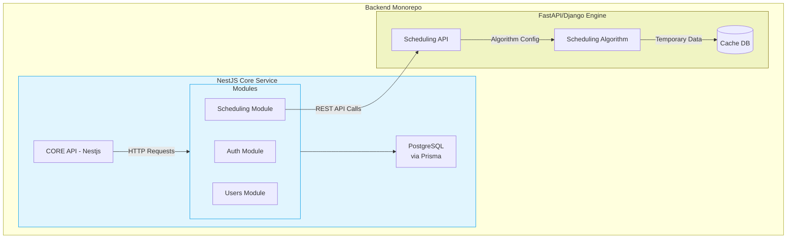

# Backend Structure
## System Structure
Our backend follows a monorepo structure with clear service boundaries, designed for scalability and maintainability. The architecture separates core application logic from specialized scheduling operations while promoting code reuse through shared resources.

Separating the core logic into a nestjs api, and delegating the actual scheduling to a python based framework like FASTAPI/Django.

***diagram made with mermaid.js. extension to view it in vscode: https://marketplace.cursorapi.com/items?itemName=bierner.markdown-mermaid***

## Core(Nestjs) Structure
### Overview
The Core API serves as the backbone of the backend application, built using NestJS. It is responsible for handling all web operations and business logic related to user management, authentication, and scheduling functionalities. The API is structured into distinct modules, each focusing on a specific domain, which is ig the way nest is usually structured. Here's some example modules:

1. **Auth Module**: Manages user authentication processes, including registration and login, while implementing role-based access control (RBAC) for secure access to resources.

2. **Users Module**: Handles user data management, allowing for the retrieval, updating, and deletion of user profiles.

3. **Scheduling Module**: Integrates with the scheduling engine, facilitating communication and data exchange for generating and managing schedules.

Each module will contain it's own dtos and unit tests for teh controller and the services.

### Directory Structure Breakdown

## Directory Structure
        backend/
        ├── core/                   # Main NestJS Application 
        │   ├── src/
        │   │   ├── modules/        # Split by domain features
        │   │   │   ├── auth/       # Authentication module
        │   │   │   ├── scheduling/ # Scheduling integration module
        │   │   │   ├── users/      # User management module
        │   │   │   └── ...         # Other modules
        │   │   ├── shared/         # Reusable components
        │   │   │   ├── decorators/ # Custom decorators
        │   │   │   ├── filters/    # Exception filters
        │   │   │   ├── interceptors/ # Request interceptors
        │   │   │   └── ...         # Other shared utilities
        │   │   ├── main.ts         # Existing entry file
        |   |   └── ...
        ├── scheduling-engine/      # Second API Application (FastAPI/Django)
        │   ├── app/
        │   │   ├── core/           # Scheduling algorithm implementation
        │   │   ├── routers/        # API endpoints
        │   │   └── ...             # Service-specific structure
        ├── docker/                 # Docker configurations
        │   ├── core.Dockerfile
        │   ├── scheduling.Dockerfile
        │   └── ...
        ├── scripts/                # Deployment/maintenance scripts
        ├── docs/                   # Technical documentation
        ├── docker-compose.yml      # Local development setup
        ├── package.json            # Workspace config (if using npm workspaces)
        └── .env.example            # Environment template

#### Core Service (`core/`)
The primary NestJS application handling web operations and business logic

#### Scheduling Engine (`scheduling-api/`)
Independent service for timetable generation (FastAPI/Django):

#### Shared Directory Structure
The `shared/` directory contains reusable components that cut across multiple modules:

1. **Decorators** (e.g., `@Public()` to bypass authentication)
2. **Filters** (Global exception handlers)
3. **Interceptors** (Request/response transformers, sentry/posthog interceptor for logging)
4. **Pipes** (Validation and data transformation)
5. **Guards** (Extended authentication checks)
6. **Utilities** (Common helpers like date formatting or sth)

