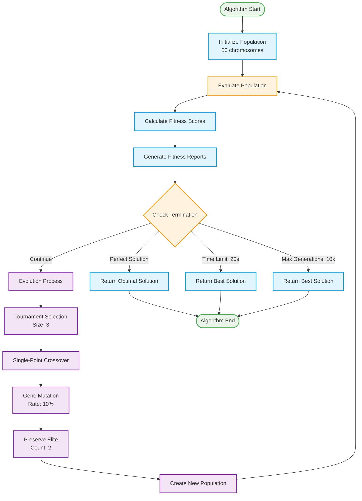
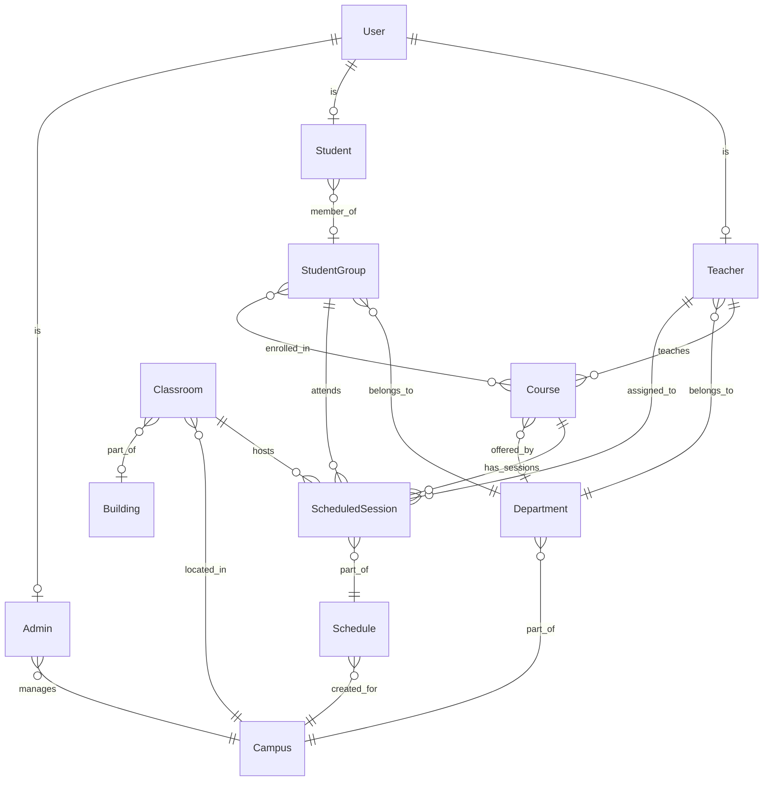
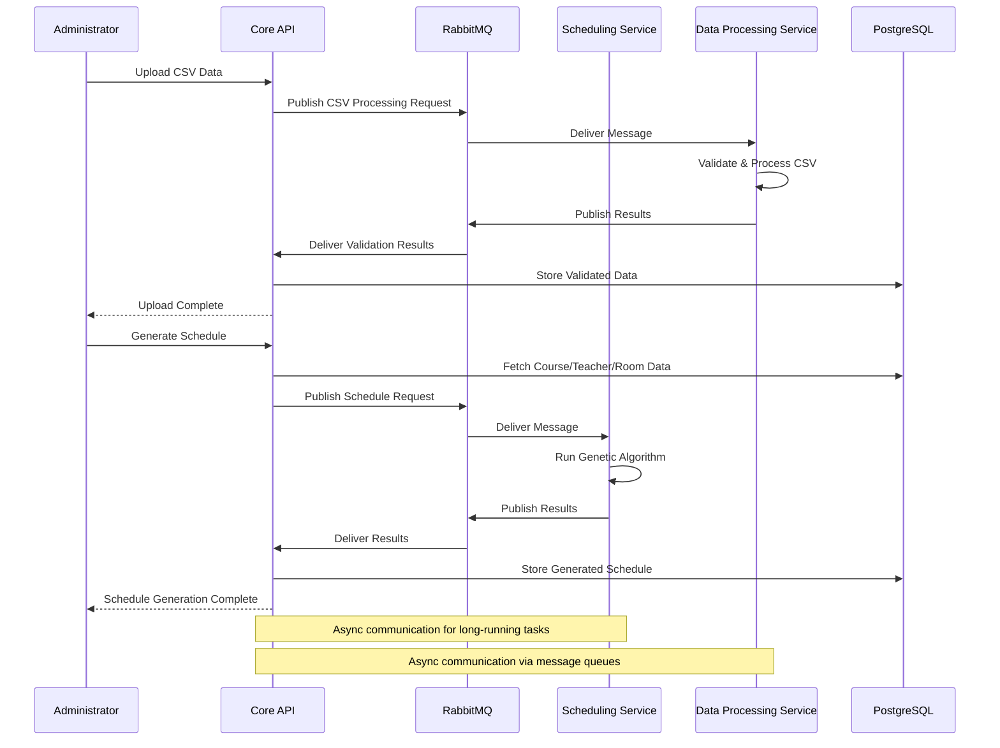

# Intelligent Scheduling System (ISS) - Backend Design2

## Overview

The Intelligent Scheduling System (ISS) is an AI-powered platform designed to optimize university timetables using advanced genetic algorithms. The system automatically generates schedules that satisfy hard constraints (room conflicts, teacher availability) and soft constraints (preferences, accessibility) while providing a modern web interface for administrators, teachers, and students.

The backend follows a microservices architecture with three main services:

- **Core Service (NestJS)**: Main API gateway handling authentication, data management, and business logic
- **Scheduling Service (FastAPI)**: Genetic algorithm engine for timetable optimization  
- **Data Processing Service (Python)**: CSV file processing and validation via message queues

## System Architecture

```mermaid
graph TB
    subgraph "Client Layer"
        WEB[Web Frontend]
        API_CLIENTS[API Clients]
    end

    subgraph "Backend Services"
        subgraph "Core Service (NestJS)"
            CORE_API[Core API Server]
            AUTH[Authentication Module]
            USERS[Users Module] 
            TEACHERS[Teachers Module]
            COURSES[Courses Module]
            ROOMS[Classrooms Module]
            BUILDINGS[Buildings Module]
            DEPARTMENTS[Departments Module]
            GROUPS[Student Groups Module]
            SCHEDULING[Scheduling Module]
            FILES[File Processing Module]
            HEALTH[Health Module]
        end

        subgraph "Scheduling Engine (FastAPI)"
            SCHED_API[Scheduling API]
            GA_ENGINE[Genetic Algorithm Engine]
            FITNESS[Fitness Evaluator]
        end

        subgraph "Data Processing (Python)"
            PYTHON_SERVICE[Python Service]
            CSV_PARSER[CSV Processing Engine]
            VALIDATION[Data Validation]
        end

        subgraph "Infrastructure"
            RABBITMQ[Message Queue - RabbitMQ]
            POSTGRES[(PostgreSQL Database)]
            PRISMA[Prisma ORM]
        end
    end

    subgraph "External Services"
        SENTRY[Sentry - Error Tracking]
    end

    WEB --> CORE_API
    API_CLIENTS --> CORE_API

    CORE_API --> AUTH
    CORE_API --> USERS
    CORE_API --> TEACHERS
    CORE_API --> COURSES
    CORE_API --> ROOMS
    CORE_API --> BUILDINGS
    CORE_API --> DEPARTMENTS
    CORE_API --> GROUPS
    CORE_API --> SCHEDULING
    CORE_API --> FILES
    CORE_API --> HEALTH

    SCHEDULING --> RABBITMQ
    RABBITMQ --> SCHED_API
    SCHED_API --> GA_ENGINE
    GA_ENGINE --> FITNESS

    FILES --> RABBITMQ
    RABBITMQ --> PYTHON_SERVICE
    PYTHON_SERVICE --> CSV_PARSER
    CSV_PARSER --> VALIDATION

    CORE_API --> PRISMA
    PRISMA --> POSTGRES

    CORE_API --> SENTRY
    SCHED_API --> SENTRY

    classDef coreService fill:#e1f5fe,stroke:#039be5,stroke-width:2px
    classDef schedService fill:#f3e5f5,stroke:#7b1fa2,stroke-width:2px
    classDef dataService fill:#e8f5e8,stroke:#2e7d32,stroke-width:2px
    classDef infrastructure fill:#fff3e0,stroke:#f57c00,stroke-width:2px
    classDef external fill:#fce4ec,stroke:#c2185b,stroke-width:2px

    class CORE_API,AUTH,USERS,TEACHERS,COURSES,ROOMS,BUILDINGS,DEPARTMENTS,GROUPS,SCHEDULING,FILES,HEALTH coreService
    class SCHED_API,GA_ENGINE,FITNESS schedService  
    class PYTHON_SERVICE,CSV_PARSER,VALIDATION dataService
    class RABBITMQ,POSTGRES,PRISMA infrastructure
    class SENTRY external
```

## Core Service (NestJS)

The core service serves as the main API gateway, handling authentication, data management, and orchestrating communication with other microservices.

### Key Features

- **JWT-based Authentication** with role-based access control (Admin, Teacher, Student)
- **Prisma ORM** for type-safe PostgreSQL operations
- **Modular Architecture** with dedicated modules for each domain
- **RESTful API** with Swagger/OpenAPI documentation
- **Input Validation** using class-validator and DTOs
- **Error Tracking** via Sentry integration

### Module Structure

The core service contains the following modules:

- **Auth Module**: JWT authentication and role-based access control
- **Users Module**: User profile management and CRUD operations
- **Teachers Module**: Teacher-specific data and preferences
- **Student Groups Module**: Management of student cohorts and groups
- **Courses Module**: Course definitions and academic content
- **Departments Module**: Academic department organization
- **Classrooms Module**: Room management and facility data
- **Buildings Module**: Building and location information
- **Scheduling Module**: Orchestrates scheduling requests and results
- **File Module**: Handles CSV uploads and data import coordination
- **Health Module**: Service monitoring and health checks

## Scheduling Service (FastAPI)

The scheduling service implements a sophisticated genetic algorithm for timetable optimization, operating as an independent microservice communicating via RabbitMQ.

### Algorithm Parameters

- **Population Size**: 50 chromosomes
- **Max Generations**: 10,000
- **Gene Mutation Rate**: 10%
- **Chromosome Mutation Rate**: 20%
- **Tournament Selection Size**: 3
- **Elitism Count**: 2 (best individuals preserved)
- **Time Limit**: 20 seconds

### Genetic Algorithm Flow



### Constraint System

**Hard Constraints (Must be satisfied):**

- **Resource Conflicts**: No double-booking of rooms, teachers, or student groups
- **Room Type Matching**: Sessions assigned to appropriate room types (lecture, lab, seminar)
- **Wheelchair Accessibility**: Accessible rooms for teachers/students requiring them
- **Data Integrity**: All referenced entities must exist
- **Timeslot Validity**: Valid day and time assignments

**Soft Constraints (Preferences to optimize):**

- **Teacher Preferences**: Preferred working hours and room assignments
- **Schedule Distribution**: Optimal spacing of sessions throughout the week
- **Course Priority**: Earlier scheduling for high-ECTS/difficulty courses
- **Room Utilization**: Efficient use of available classroom space

## Data Processing Service (Python)

Handles CSV file uploads and validation via RabbitMQ message queues, built using Python with pandas for data manipulation.

### Key Capabilities

- **CSV Processing**: Teachers, courses, rooms, departments, student groups
- **Data Validation**: Type checking, format validation, constraint checking
- **Error Reporting**: Detailed feedback on validation failures
- **Message Queue Integration**: Async processing via RabbitMQ

## Database Schema



## Inter-Service Communication



## Technology Stack

- Core Service (NestJS)

- **Runtime**: Node.js with TypeScript
- **Framework**: NestJS with Express
- **ORM**: Prisma
- **Authentication**: JWT with Passport.js
- **Validation**: class-validator, class-transformer
- **Documentation**: Swagger/OpenAPI
- **Testing**: Jest

- Scheduling Service (FastAPI)

- **Runtime**: Python 3.9+
- **Framework**: FastAPI
- **Algorithm**: Custom Genetic Algorithm
- **Data Models**: Pydantic
- **Performance**: NumPy for computations

- Data Processing Service (Python)

- **Runtime**: Python 3.9+
- **Data Processing**: pandas, NumPy
- **Message Queue**: pika (RabbitMQ client)
- **File Handling**: CSV processing utilities

### Infrastructure

- **Database**: PostgreSQL 15
- **Message Queue**: RabbitMQ
- **Containerization**: Docker & Docker Compose
- **Error Tracking**: Sentry
- **Load Balancing**: Nginx (production)

## Development Workflow

### Local Development Setup

```bash
# Start infrastructure services
docker-compose up postgres rabbitmq

# Core service
cd core
npm install
npm run prisma:generate
npm run prisma:migrate:dev
npm run start:dev

# Scheduling service  
cd ../scheduling-service
python -m venv .venv
source .venv/bin/activate
pip install -r requirements.txt
python -m uvicorn app.main:app --reload --port 8001

# Data processing service
cd ../python-service
pip install -r requirements.txt
python main.py
```

## Security & Performance

### Security Features

- **JWT Authentication** with role-based access control
- **Input Validation** at all API boundaries
- **SQL Injection Prevention** via Prisma ORM
- **Environment-based Configuration** for sensitive data
- **Audit Logging** for administrative actions

### Performance Optimizations

- **Database Indexing** on foreign keys and query columns
- **Connection Pooling** for concurrent requests
- **Algorithm Optimization** with early termination and constraint caching
- **Message Queue** for asynchronous processing
- **Horizontal Scaling** support for core and scheduling services

### Monitoring & Observability

- **Sentry Integration** for real-time error tracking
- **Health Check Endpoints** for service monitoring
- **Performance Profiling** for algorithm optimization
- **Resource Utilization** monitoring

This architecture provides a robust, scalable foundation for the Intelligent Scheduling System, enabling efficient timetable generation while maintaining high availability and performance standards.
