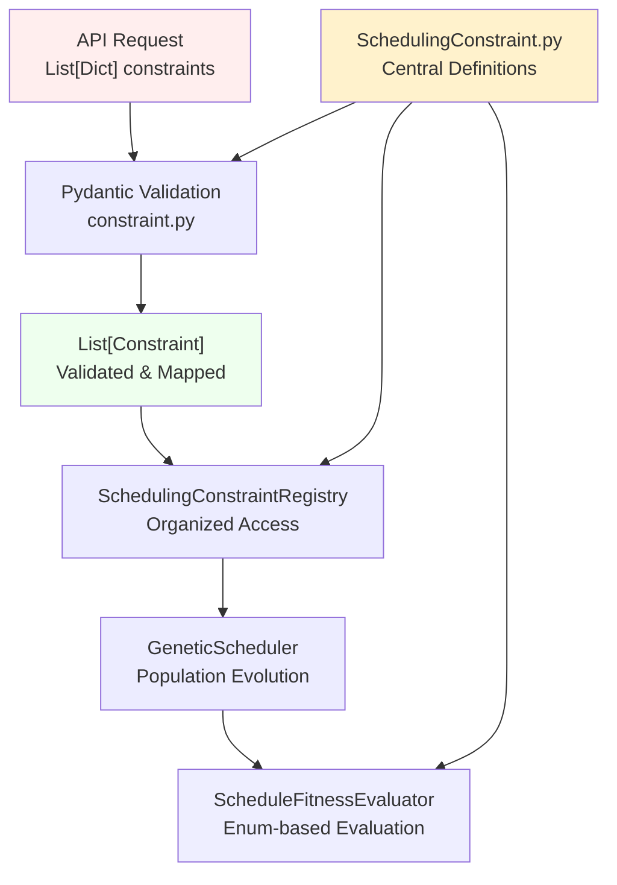

# Scheduling API

## TODO

- [x] Implement the GA scheduling algorithm v1 (Hard constraints only)
  - [x] Implement the fitness function
  - [x] Implement the selection
  - [x] Implement the crossover
  - [x] Implement the mutation
  - [x] Implement the GA algorithm
- [x] Fix the fitness function(keeps flagging valid schedules invalid)
- [x] Implement the API
- [ ] Room accessibility handling
- [ ] Test the API
- [ ] Add soft constraints
- [ ] Optimize the fitness function
- [ ] Optimize the GA algorithm
- [ ] Implement heuristic solutions for the GA algorithm selection/mutation/crossover functions
- [ ] Granular timeslot handling
- [ ] Add a simple validity check before the algorithm runs to ensure that the given courses CAN be scheduled. (Having more courses than timeslots and available rooms for instance)
- [ ] Improve the algorithm stopping conditions. (for instance: For harder problems, letting the algorithm run for a limited time would be better if each generation takes a long time. other methods should be explored as well)

## Abandoned

- [ ] Assigning instructors to courses? (nah fuck this one)

## Algorithm Design

We will use a genetic algorithm to schedule the courses.

### Population

The population will be a list of scheduled items. Each chromosome will be a list of scheduled items.

ScheduledItem:

- courseId
- teacherId
- studentGroupId
- classroomId
- timeslot
- day

The algorithm will return the top 3 after running for a set number of generations

### Fitness Function

Fitness function will be a weighted sum of the hard and soft constraints. Hard constraints are violations that will result in the schedule being invalid. Soft constraints are violations that will result in the schedule being less optimal. To avoid cases where there are no valid solutions, hard constraints will have a very large penalty instead of invalidating the schedule.

Hard constraints:

- Classroom capacity
- Teacher availability
- Student group availability
- Overlapping room/teacher/student group

Soft constraints:

- Teacher preference
- Student group preference
- Classroom accessibility (for now. this will be moved to hard constraints later)

Performance will be critical here, so we will need to optimize the fitness function. Maybe a lookup table for checking timeslot/room conflicts?

### Selection

We will use a tournament selection to select the parents.

### Crossover

We will use a single point crossover to create the offspring.

### Mutation

We will swap the scheduled timeslot or room for a 2 random scheduled items. (This will need to be done smarter with a heuristic later)
