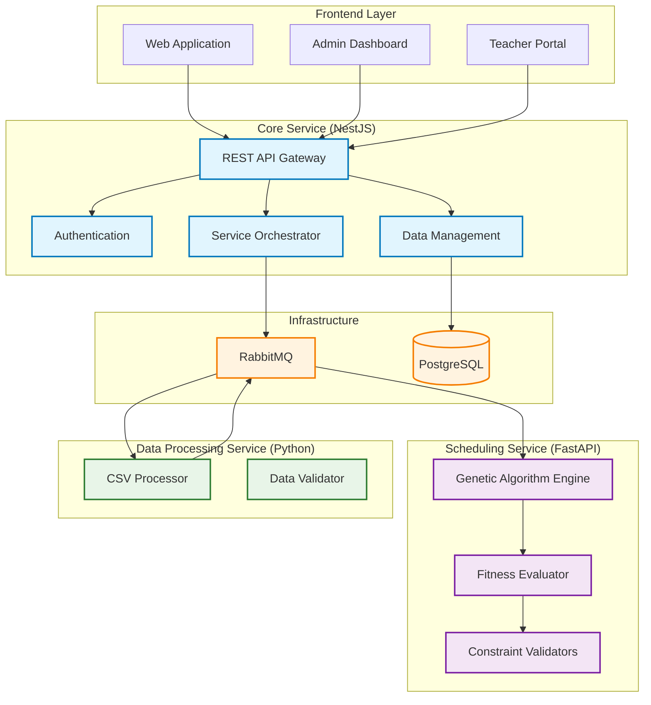
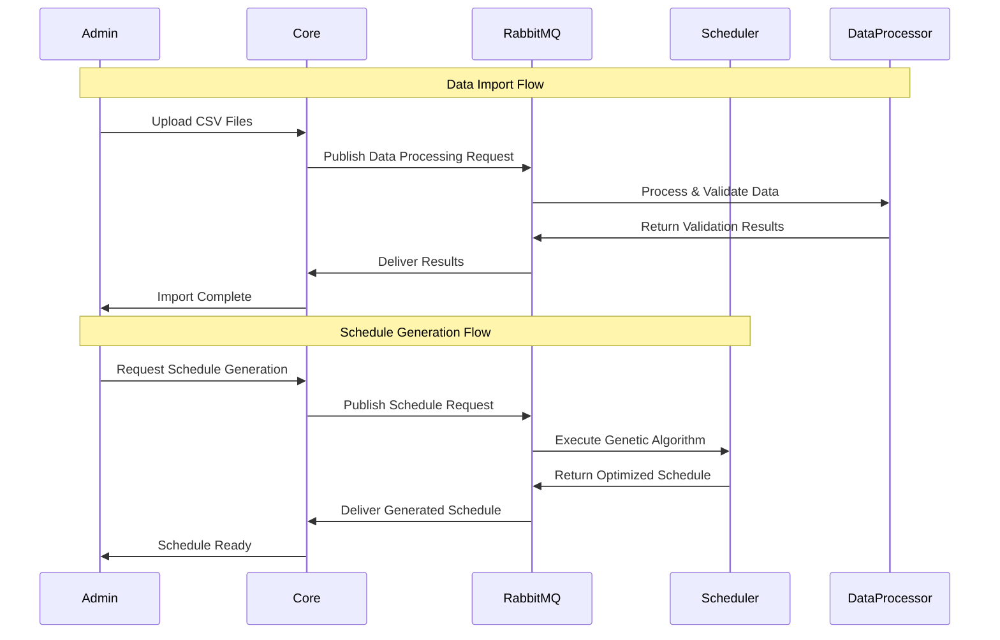
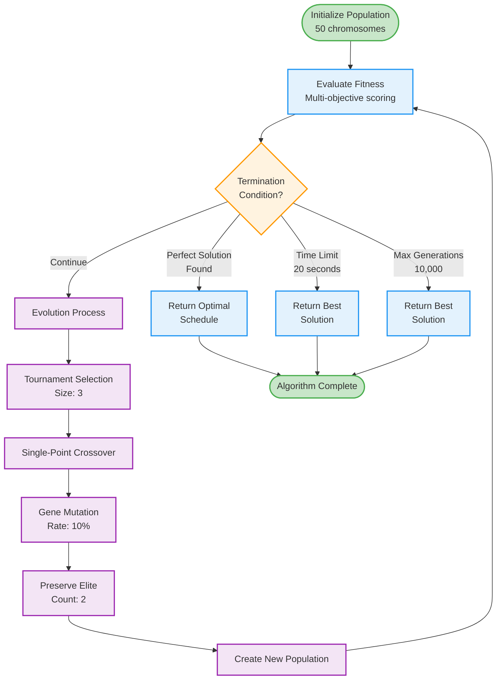
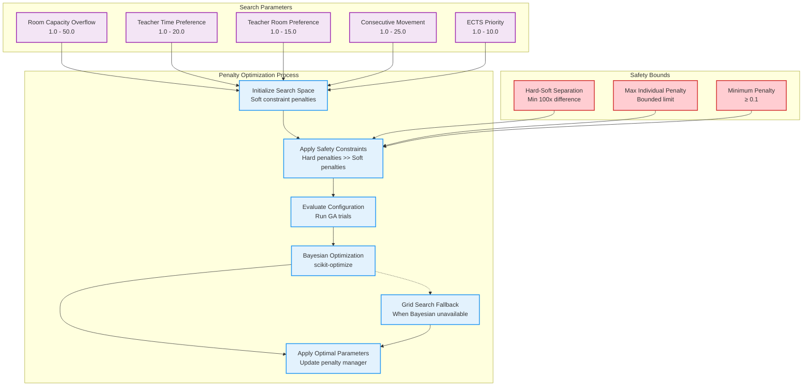
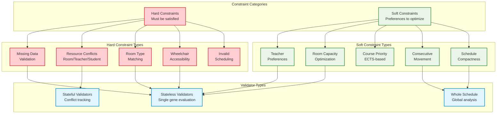

# Intelligent Scheduling System (ISS)

An AI-powered platform that automatically generates optimized university timetables using advanced genetic algorithms and constraint satisfaction techniques.

>**This repository contains the backend code, the readme below focuses on the system architecture and design.**

>**For the frontend code, it can be found <a href='https://github.com/JohnnyPro/intelligent-scheduler-frontend'> here </a>**

## Problem & Solution

Traditional university scheduling relies on manual processes or simple rule-based systems that struggle with complex constraints. ISS solves this by:

- **Automated optimization** of course schedules considering multiple constraints simultaneously
- **Stakeholder satisfaction** by incorporating teacher preferences and student needs
- **Resource efficiency** through optimal room and time allocation
- **Accessibility compliance** ensuring wheelchair access and special accommodations

The system uses genetic algorithms instead of traditional approaches because they handle soft constraints naturally, provide bounded execution time, and scale well with increasing complexity.

## System Architecture

ISS uses a microservices architecture with three specialized services:

### Service Responsibilities

**Core Service (NestJS)**

- API gateway and request routing
- User authentication and authorization
- Data management for all entities (courses, teachers, rooms, etc.)
- Service coordination and result aggregation

**Scheduling Service (FastAPI)**

- Genetic algorithm execution for timetable optimization
- Constraint validation and fitness evaluation
- Multi-objective optimization with real-time progress tracking

**Data Processing Service (Python)**

- CSV file processing and bulk data import
- Data validation and error reporting
- Format standardization

### Communication Flow

## Genetic Algorithm Design

The scheduling engine uses a custom genetic algorithm optimized for timetabling problems:

### Key Algorithm Features

**Population Structure**: Each chromosome represents a complete timetable with genes corresponding to individual course sessions.

**Fitness Evaluation**: Multi-objective scoring system that heavily penalizes hard constraint violations (1000x multiplier) while optimizing soft constraints through weighted penalties.

**Selection Strategy**: Tournament selection with elitism ensures both exploration and preservation of high-quality solutions.

**Mutation Strategy**: Adaptive mutation targeting room assignments, time slots, and days based on constraint types.

**Termination Conditions**: Algorithm stops when finding perfect solutions, reaching time limits, or exhausting generations.

### Penalty Optimization System

The system includes an advanced penalty optimization component that automatically tunes constraint penalty weights for optimal scheduling quality:

**Optimization Features**:

**Bayesian Optimization**: Uses Gaussian process models to efficiently explore the penalty parameter space with Expected Improvement acquisition function.

**Safety Constraints**: Maintains hard constraint dominance by ensuring hard penalties are always at least 100x larger than the maximum possible soft penalty total.

**Multi-Trial Evaluation**: Runs multiple GA trials for each parameter configuration to ensure statistical significance and minimize variance in results.

**Adaptive Fallback**: Automatically switches to grid search when scikit-optimize is unavailable, ensuring system robustness.

**Configuration Validation**: All parameter updates are validated against safety bounds before application to prevent invalid penalty configurations.

## Constraint System Architecture

The constraint system uses a sophisticated validator pattern to handle different types of scheduling requirements:

### Constraint Validation Strategy

**Stateless Validators**: Evaluate individual course assignments independently. Examples include room type matching and basic data validation.

**Stateful Validators**: Track resource usage across the schedule to detect conflicts. They build conflict maps during evaluation for efficient O(1) lookup.

**Whole Schedule Validators**: Analyze global patterns like teacher movement between consecutive classes or schedule compactness.

### Constraint Priority System

Hard constraints are treated as absolute requirements with binary violation detection. Soft constraints use priority-weighted scoring where:

- Teacher preferences include priority levels (1-10)
- Institutional policies have fixed priority weights
- User-defined constraints allow custom priority assignment

## Technology Stack

### Backend Services

- **Core Service**: NestJS + TypeScript + Prisma ORM + PostgreSQL
- **Scheduling Service**: FastAPI + Python + Pydantic + NumPy
- **Data Processing**: Python + pandas + RabbitMQ integration

### Infrastructure

- **Database**: PostgreSQL with automated migrations
- **Message Queue**: RabbitMQ for async communication
- **Containerization**: Docker + Docker Compose
- **Monitoring**: Sentry for error tracking

### Development Tools

- **Authentication**: JWT with role-based access control
- **API Documentation**: Swagger/OpenAPI auto-generation
- **Testing**: Jest (Node.js), pytest (Python)
- **Type Safety**: Full-stack TypeScript integration

## Key Design Decisions

### Microservices Architecture

Enables language specialization (Python for algorithms, TypeScript for APIs), independent scaling, and fault isolation. Scheduling failures don't impact user management.

### Genetic Algorithm Choice

Better handling of soft constraints compared to constraint programming, bounded execution time suitable for web applications, and natural multi-objective optimization.

### Message Queue Communication

Handles long-running genetic algorithm execution beyond HTTP timeouts, provides reliability through message persistence, and enables load balancing across multiple instances.

### Strategy Pattern for Constraints

Allows dynamic constraint addition without code modification, enables independent testing of constraint types, and supports database-driven constraint configuration.

## Getting Started

1. **Prerequisites**: Docker, Node.js 18+, Python 3.9+
2. **Infrastructure**: Start PostgreSQL and RabbitMQ with Docker Compose
3. **Core Service**: Install dependencies, run migrations, start NestJS server
4. **Scheduling Service**: Set up Python environment, install requirements, start FastAPI
5. **Data Processing**: Configure Python service for CSV processing

The system provides a complete web interface for administrators to manage data, configure constraints, and generate optimized schedules with real-time progress tracking.
